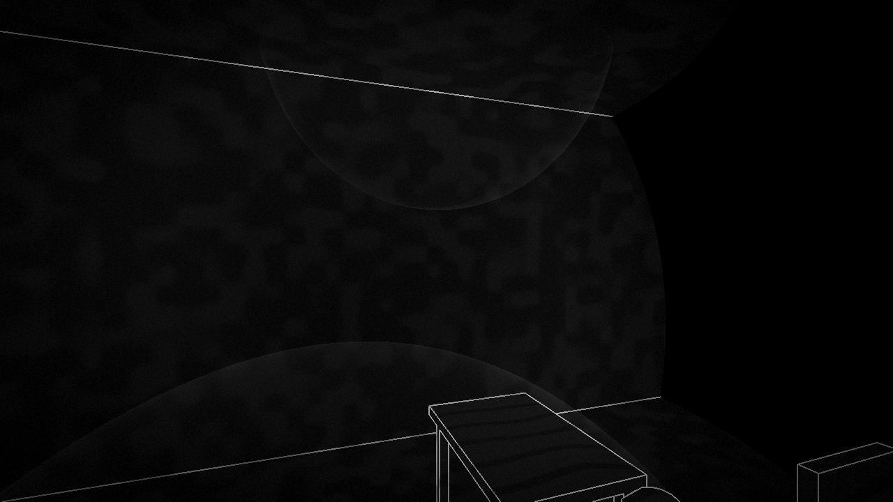

# Unseeing

A first-person echolocation game built in Godot 4. The hero is blind: the
world exists only as sound. Cane taps and footsteps send visible waves through
the dark; thin white outlines flare where a wave strikes geometry and fade
away; every surface answers back — echoes bloom from what the wavefront
touches.

**Play:** https://206.223.241.165 — best in a Chromium browser.
(`?demo` makes the game tap by itself, if you just want to watch.)

## Controls

- `W A S D` — walk (physical key positions; works on any keyboard layout)
- mouse — look
- click — tap the cane: strikes what you aim at within reach, otherwise taps
  whatever the cane tip is resting on; sweeping empty air answers with nothing
- `Esc` — release the mouse

## How it works

Everything visible is sound. A **data pass** renders the world not as an
image but as data — how recently a wave swept each point, a per-vertex face
label, and camera distance — packed into color channels. At level derivation,
Rust joins same-facing coplanar overlaps into **superfaces** and bakes one
bit-identical class label into those faces' `CUSTOM0` vertices; faces that
must draw a crease receive labels at least `MIN_SEP` (0.08) apart. Creatures
use fixed numeric role labels; sound sources keep semantic limb roles while
the level derives separated numeric labels for each placed instance. A
fullscreen **hearing pass** turns that data into everything you see: thin
white outlines, and only where waves have swept. Two kinds of line make them
— silhouettes, where packed distance steps, and creases, where the face label
changes. Flush overlaps therefore melt without a depth-fighting seam, while
bends, steps, and separate touching solids still draw. Expanding wave shells
are ray-traced in air and occluded by the world, so obstacles carve visible
bites out of the rings. **Echo reflections** sample the world with physics ray
fans from every sound — each struck surface point becomes a secondary emitter
firing exactly when the wavefront arrives, and anything in acoustic shadow
stays silent. No texture assets exist — the world is nothing but thin white
lines on black.

See `game/README.md` for the architecture and porting status.

## Platforms

One Godot project, exported everywhere — no per-platform code:

- **Web** — continuously deployed to https://206.223.241.165 (wasm).
- **macOS** — universal binary (x86_64 + arm64): `godot --headless --path
  game --export-release macOS build/macos/unseeing.zip`
- **Windows** — twin exports, `"Windows x86_64"` and `"Windows arm64"`
  presets. The game never relies on a particular architecture.

## Development

For the complete first-time setup, correct-worktree check, editor tour, and
code-free level-running workflow, follow
[Opening and running Unseeing in Godot](docs/opening-in-godot.md). The short
version is to run `tools/bootstrap.sh` on macOS/Linux or
`tools\bootstrap.cmd` on Windows, open `game/project.godot` in the Godot
version pinned by `.godot-version`, and press play. Renderer is
`gl_compatibility` — required for the Web export. One-time contributor setup:
`git config core.hooksPath .githooks` and `pipx install "gdtoolkit==4.*"` —
every commit is gated by `gdformat` and `gdlint`.

Claude Code and Codex App/CLI contributors should follow the pinned,
repository-local setup and upgrade guide in [docs/agent-workflow.md](docs/agent-workflow.md).
The agent plugin is developer tooling and is excluded from game and deployment
artifacts.

- `rust/` — the wave/physics core as a GDExtension (godot-rust). Pure laws
  live in engine-free modules under plain `cargo test`; registered adapters
  under `rust/src/nodes/` and the narrow `ffi` boundary translate between
  those laws and Godot types. `rust/build-wasm.sh` builds the single-threaded
  wasm for the web export (toolchain pins and their reasons are documented in
  the script).
- `ci/pipeline.sh` — the full gauntlet: vendored-framework integrity check,
  cargo fmt/clippy/test + release build, format + lint gate, headless boot
  check, unit tests (`game/tests/`), the wasm core build, clean Web export,
  build stamping, precompression of every shipped artifact, and a browser
  smoke test that boots the exported wasm in headless Chrome and asserts it
  renders. The same POSIX script runs locally, on the droplet, and in cloud
  CI — and when it runs on prebuilt cores it refuses any whose recorded
  commit is not the one being deployed.
- `game/addons/gdUnit4/` — the test framework. Godot resolves addons as
  project resources, so it lives in the tree rather than as a submodule
  (upstream ships no `.uid` sidecars; Godot mints 244 of them on import,
  which inside a submodule would be permanently dirty and uncommittable).
  The copy is pinned by `ci/gdunit4.lock` and reproduced byte-for-byte by
  `ci/vendor-gdunit4.sh update <tag>` — the only sanctioned way to change
  it. The pipeline verifies its fingerprint on every run, and its in-editor
  self-updater is switched off so a version bump is always a reviewed commit.
- `deploy.sh` — refuses anything but a clean `main` first (the cores below
  are compiled from the working tree while the push ships the branch, so
  those have to be the same code), then local checks, then cross-builds the
  linux and wasm cores the 1.8 GB droplet cannot compile itself and seeds
  them — with the commit they were built from — over ssh. Then
  `git push production` (the droplet's post-receive hook runs the pipeline
  server-side and deploys only on green), then `git push origin`.
- `infra/` — versioned copies of the droplet's hook and nginx config.

## License

MIT — see [LICENSE](LICENSE). The name "Unseeing" and any future art/audio
assets are not covered by the code license.
